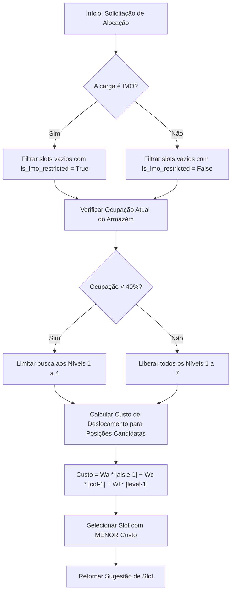
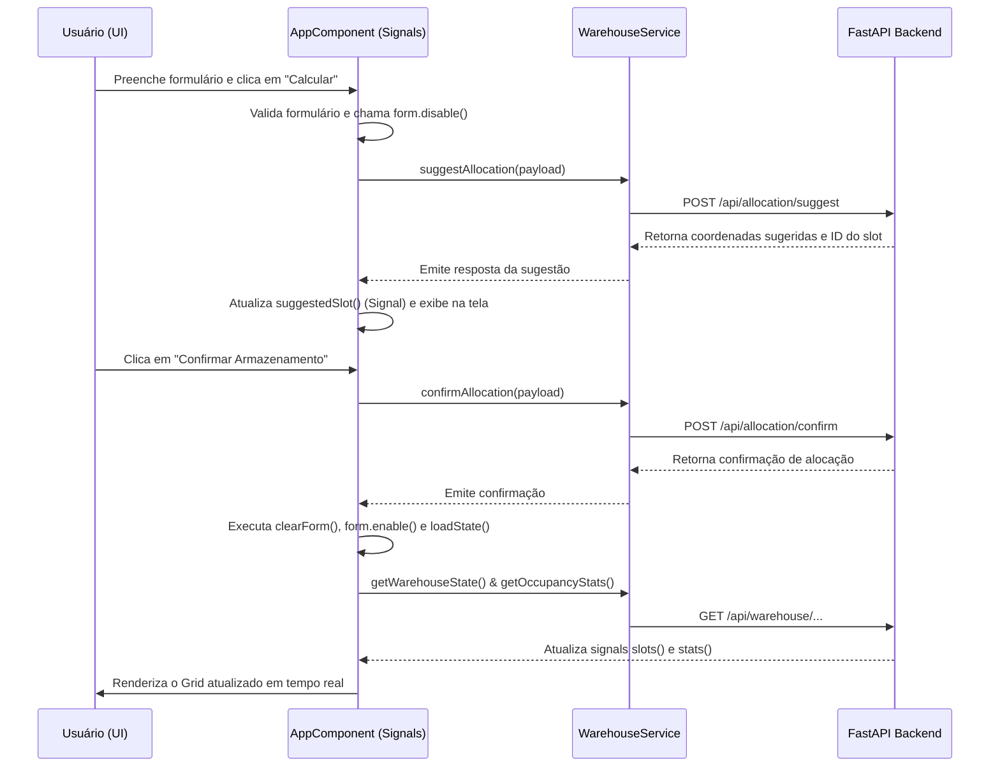

# Argos Armazém &mdash; Gêmeo Digital (Digital Twin)

O **Argos Armazém** é um protótipo de Gêmeo Digital (Digital Twin) projetado para monitorar e otimizar a alocação e movimentação de cargas no armazém autoportante da **Wilson Sons**. A solução calcula a alocação ideal de cargas através de uma heurística que minimiza o tempo de deslocamento das empilhadeiras e garante o cumprimento de restrições rígidas de segurança.

---

## 🏗️ 1. Arquitetura da Solução

Esta seção detalha a visão geral, a organização das camadas e as decisões de design arquitetural de cada ponta do sistema.

### 🔌 Backend (FastAPI + SQLAlchemy)
- **Visão Geral**: O backend é construído em Python utilizando o framework **FastAPI**, focado em alto desempenho, validação automática com Pydantic e documentação OpenAPI nativa.
- **Camadas e Organização (`backend/app/`)**:
  - `database.py`: Gerenciamento do ciclo de vida das conexões através de sessões do SQLAlchemy. Suporta de forma transparente SQLite (desenvolvimento) e PostgreSQL (produção).
  - `models.py`: Modelagem relacional do banco de dados contendo duas entidades principais: `Slot` (coordenada física `(aisle, column, level)`) e `Load` (detalhes da mercadoria armazenada).
  - `schemas.py`: DTOs de entrada e saída fortemente tipados via Pydantic para validação e serialização de dados.
  - `rules.py`: O coração lógico do backend. Contém as regras de ocupação e o motor de heurística de IA para cálculo de menor custo.
  - `main.py`: Definição de rotas REST, tratamento de CORS e middleware para servir o frontend compilado em ambiente de produção.

### 💻 Frontend (Angular 20.3 Standalone + Signals)
- **Visão Geral**: Desenvolvido na versão moderna do **Angular 20**, com uma arquitetura puramente **Standalone** (sem NgModules legados) e detecção de mudanças do tipo **OnPush** para desempenho aprimorado.
- **Camadas e Organização (`frontend/src/app/`)**:
  - `app.config.ts`: Centralização dos providers de injeção global do Angular 20 (como `provideHttpClient` e `provideAnimationsAsync`).
  - `app.component.ts`: Componente principal que orquestra a lógica do Dashboard e do grid.
  - `app.component.html` & `app.component.scss`: Template declarativo estilizado com Material Angular em um tema escuro premium com glassmorphism.
  - `services/`: `warehouse.service.ts` encapsula a comunicação HTTP com a API, consumindo os tipos estritos definidos no front.
  - `utils/`: `error-messages.ts` oferece um dicionário reutilizável de erros para validação de formulários.
  - `environments/`: Definições isoladas de variáveis de configuração (`apiUrl`) para produção e desenvolvimento.

---

## 📊 2. Diagramas e Fluxos de Dados

Abaixo estão descritos os diagramas estruturais e de comportamento que ilustram a dinâmica do sistema.

### 🔌 Backend (Algoritmo de Alocação de IA)
O diagrama abaixo detalha o fluxo de decisão do motor de heurística de alocação de cargas no backend:



### 💻 Frontend (Interações Reativas de Componente)
O diagrama a seguir representa a comunicação entre o componente do frontend e o backend:



---

## 🛠️ 3. Módulos e Funcionalidades

Detalhes operacionais e endpoints associados a cada área do sistema.

### 🔌 Backend (Endpoints da API REST)
O backend expõe as seguintes rotas na URL base `/api`:
- **Monitoramento**:
  - `GET /warehouse/state`: Retorna a listagem completa de todas as coordenadas (`SlotOut[]`) e os metadados das cargas atualmente alocadas nelas.
  - `GET /warehouse/occupancy`: Retorna estatísticas gerais (`OccupancyStats`) contendo a ocupação em porcentagem, slots livres/ocupados e o limite de nível ativo.
- **Alocação de Carga**:
  - `POST /allocation/suggest`: Recebe os dados de SKU, Peso e Classe IMO e calcula a posição sugerida baseada na heurística de custo.
  - `POST /allocation/confirm`: Associa e persiste o registro de uma carga (`Load`) a um `Slot` específico, alterando o status deste para ocupado.
  - `POST /allocation/unload`: Desvincula e apaga a carga associada a um determinado `Slot`, liberando a posição no armazém.
  - `POST /warehouse/reset`: Reseta e esvazia 100% das posições do armazém de uma única vez.

### 💻 Frontend (Elementos Visuais e Formulários)
O frontend organiza a interface nos seguintes painéis interativos:
- **Painel de Entrada de Cargas (Sidenav)**:
  - Formulado com um `FormGroup` reativo contendo controles estruturados (`sku`, `name`, `weight`, `isImo`).
  - Lida com feedbacks dinâmicos de validação utilizando o dicionário global `error-messages.ts` (ex: campos obrigatórios, pesos mínimos).
  - O estado do formulário (`disabled`/`enabled`) é manipulado via TypeScript a fim de congelar alterações enquanto o usuário avalia uma sugestão de alocação da IA.
- **Digital Twin Grid (Visualizador de Posições)**:
  - Renderiza de forma dinâmica 2 corredores (Aisle 1 e Aisle 2), contendo 10 colunas e 7 níveis cada (totalizando 140 slots).
  - Desenha os estados físicos e visuais de forma diferenciada:
    - **Verde**: Posição livre para cargas comuns.
    - **Azul**: Posição ocupada por carga comum.
    - **Amarelo (com ícone)**: Posição reservada para cargas IMO.
    - **Vermelho (com ícone)**: Posição IMO ocupada por carga IMO.
    - **Neon Piscante (Animação)**: Slot sugerido e recomendado pela heurística da IA.
    - **Opacidade Reduzida (Cinza escuro)**: Níveis acima de 4 bloqueados pela regra de ocupação vertical de energia (quando ocupação geral < 40%).
- **KPI Dashboard (Métricas Superiores)**:
  - Monitora o percentual de ocupação, posições livres e ocupadas na área restrita IMO através de barras de progresso circulares e horizontais do Angular Material.

---

## 🚀 4. Execução e Instalação

Como colocar os serviços em funcionamento localmente ou em produção.

### 🔌 Backend (Instalação Manual)
1. Navegue até a pasta `/backend`.
2. Certifique-se de usar Python 3.10+ e crie um ambiente virtual, se necessário.
3. Instale as dependências:
   ```bash
   pip install -r requirements.txt
   ```
4. Suba o servidor de desenvolvimento:
   ```bash
   uvicorn app.main:app --reload --port 8080
   ```
   A API responderá localmente em `http://localhost:8080`.

### 💻 Frontend (Instalação Manual)
1. Navegue até a pasta `/frontend`.
2. Certifique-se de ter o Node.js v20+ instalado.
3. Instale os pacotes npm respeitando a compatibilidade do Angular 20:
   ```bash
   npm install --legacy-peer-deps
   ```
4. Suba o servidor de desenvolvimento do Angular:
   ```bash
   npm run start
   ```
   Acesse a aplicação no navegador em `http://localhost:4200`.

### 🐳 Execução Unificada via Docker
Caso queira rodar o monólito unificado sem necessidade de instalar as stacks na máquina local:
```bash
# Na raiz do projeto
docker compose up --build
```
Isso acionará o build do container multi-stage. O frontend é compilado com otimização de produção e servido estaticamente pelo FastAPI na porta `8080`. Acesse `http://localhost:8080`.

### ☁️ Deploy de Produção no Koyeb
O projeto é 100% pronto para deploy na nuvem do **Koyeb**:
1. Crie uma aplicação tipo **Web Service** no Koyeb conectada ao repositório Git do projeto.
2. Defina o tipo de build como **Dockerfile** (o Koyeb detectará automaticamente o `Dockerfile` multi-stage na raiz).
3. Defina a porta de escuta da aplicação como `8080`.
4. Configure a variável de ambiente opcional `DATABASE_URL` apontando para um banco PostgreSQL gratuito (como Supabase ou Neon Tech) para habilitar persistência de dados duradoura na nuvem.
5. Inicie o deploy. A aplicação estará ativa em poucos minutos em uma URL pública segura fornecida pelo Koyeb.

---

## 🤖 5. Codificação Automática & Assistência (Antigravity IDE)

Este projeto foi acelerado, estruturado e refatorado de forma autônoma através da **Antigravity IDE** (plataforma da equipe do Google DeepMind voltada para engenharia de software inteligente e codificação automatizada por agentes de IA):

- **Migração Arquitetural**: Conversão automática do frontend legado de módulos em NgModules para componentes 100% standalone e controle de fluxo nativo do Angular 20.
- **Reatividade com Signals**: Otimização do estado local utilizando APIs de `signal()`, `computed()` e `toSignal()` para evitar ciclos de renderização e subscriptions manuais custosas.
- **Formulários e Validação Automatizados**: Criação e tipagem segura do formulário reativo acoplado ao dicionário centralizado de mensagens de erro.
- **Configuração Multi-stage**: Integração e acoplamento dinâmico entre o backend FastAPI e o frontend Angular no Dockerfile e nas configurações de portas e rotas.
